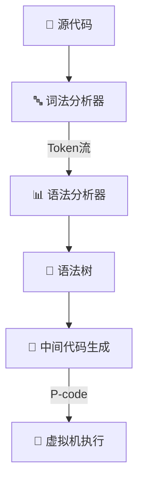

# 🎉 PL/0 编译器功能扩展项目

## 🚀 项目概述
这是一个基于经典PL/0编译器的功能扩展实现，旨在通过添加新的语言特性和优化现有功能，深入探索编译器设计的核心原理✨。项目在保留PL/0原有简洁架构的基础上，增加了ELSE子句支持、新的保留字、运算符以及更友好的不等号语法💖。

## 🌟 功能扩展

### 🆕 新增语言特性
1. **条件分支扩展** 🧩
   - 支持完整的IF-THEN-ELSE条件语句
   - 嵌套条件语句处理

2. **新增保留字** 📝
   ```pascal
   ELSE, FOR, STEP, UNTIL, DO, RETURN 🎯
   ```

3. **增强运算符支持** 🔧
   - 复合运算符: `*=`, `/=` 
   - 逻辑运算符: `&` (与), `|` (或), `!` (非) 🧠
   - 关系运算符: 将`#`改为`<>`表示不等于

### 🧱 核心模块
1. **词法分析扩展** 🔍
   - 新增关键字识别 🗝️
   - 增强运算符扫描逻辑
   - 符号表管理优化

2. **语法分析扩展** 📐
   - 递归下降分析法增强
   - ELSE子句的语法树构建 🌳
   - 错误恢复机制改进

3. **中间代码生成** ⚙️
   - JPC+JMP指令组合实现分支控制
   - 地址回填技术解决前向引用 🔙
   - 符号表层级管理优化

## 🏗️ 编译器架构



## 🛠️ 构建与运行

### 📦 依赖项
- C编译器 (Qt Creator或GCC)
- Make工具

### 🔧 编译步骤
```bash
# 克隆仓库
git clone https://github.com/your-username/pl0-compiler.git

# 进入项目目录
cd pl0-compiler

# 编译项目
make all 🛠️

# 运行编译器
./pl0 source.pl0 🚀
```

### 🧪 测试示例
```pascal
PROGRAM Sample;
VAR x, y;
BEGIN
  READ(x);
  IF x > 10 THEN
    y := x * 2; ✨
  ELSE
    y := x / 2; ✨
  WRITE(y) 📤
END.
```

## 📂 关键实现文件
- `pl0.h`：全局定义与数据结构 📚
- `pl0.c`：主程序入口 🚪
- `lexer.c`：词法分析实现 🔍
- `parser.c`：语法分析实现 📐
- `codegen.c`：中间代码生成 ⚡
- `vm.c`：虚拟机执行器 🤖

## 🚨 错误处理
编译器实现了包含20+种错误类型检测的健壮机制 💪：

```c
/* 错误代码示例 */
#define ERR_MISSING_THEN 16     // IF后缺少THEN 😢
#define ERR_MISSING_RPAREN 22   // 缺少右括号 😵
#define ERR_MISSING_STEP 38     // FOR缺少STEP 🚶‍♂️
#define ERR_MISSING_UNTIL 39    // FOR缺少UNTIL ⏳
```

## 🔮 未来扩展计划
1. 支持数组数据类型 📊
2. 添加过程参数传递 🔄
3. 实现浮点数运算 🧮
4. 增加调试器功能 🐞

## 🤝 贡献指南
欢迎通过Issues或Pull Requests贡献您的想法和代码 💡。所有贡献都需要包含相应的测试用例，并通过完整的测试套件验证 🧪。

## 📜 许可证
本项目采用MIT许可证开放源代码，详情请查看[LICENSE](LICENSE)文件 📄。
